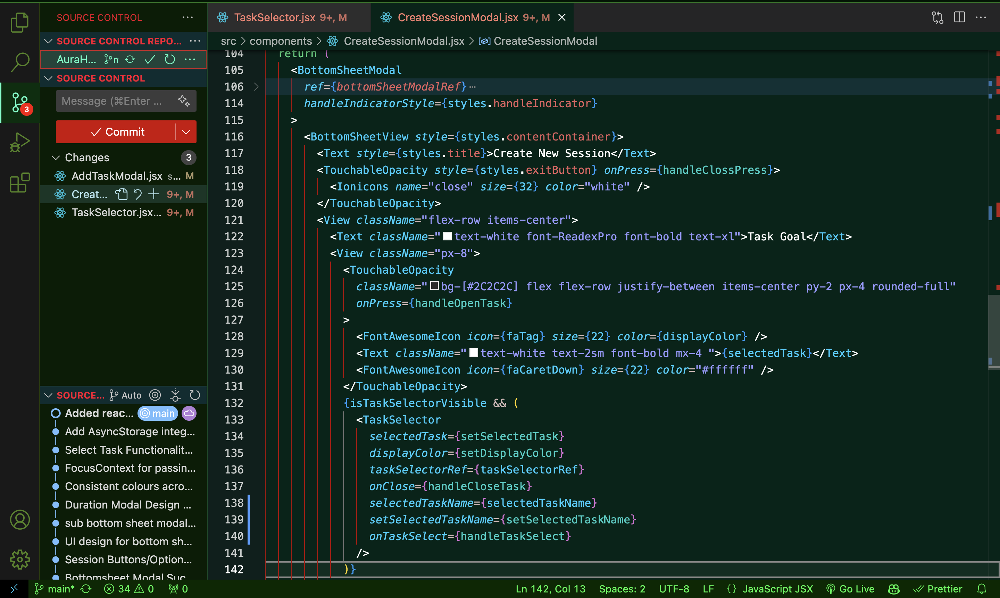

# FlameBamboo Theme

## Dark theme

I can gurantee bugs will avoid your code because it is only attracted to light!

This theme is inspired by the colors of real bamboo and flame, inherited from my own username. It's a cool dark theme designed for Visual Studio Code.

## Preview

## Installation Locally (not available on marketplace)

1. Clone the theme repository to your local machine
2. Copy the entire theme folder to your VS Code extensions directory
3. Go to Color Themes and choose FlameBamboo as the color theme.
4. Or, press `Ctrl+Shift+P` or `Cmd+Shift+P` and type `color theme`, then select FlameBamboo from the list.
